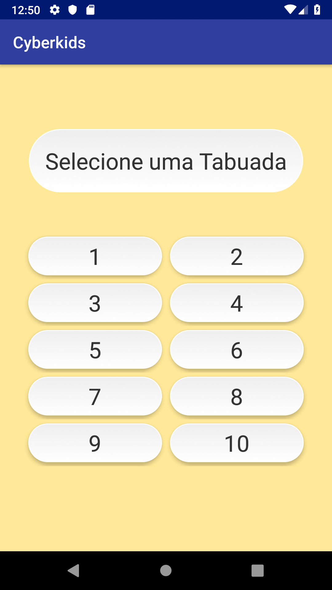
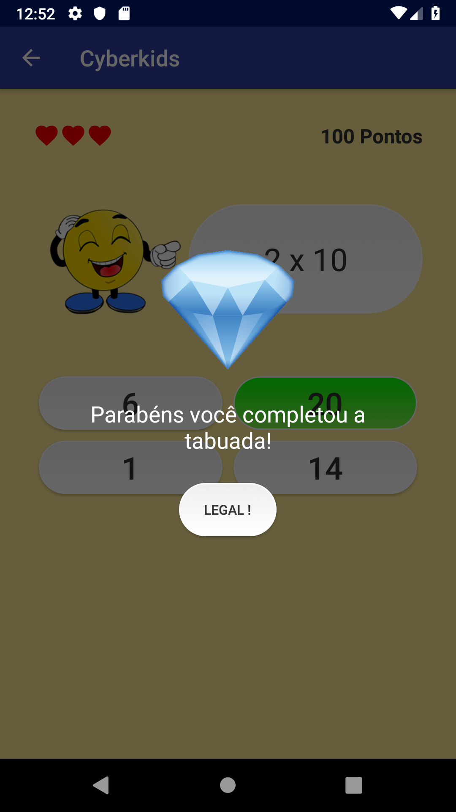
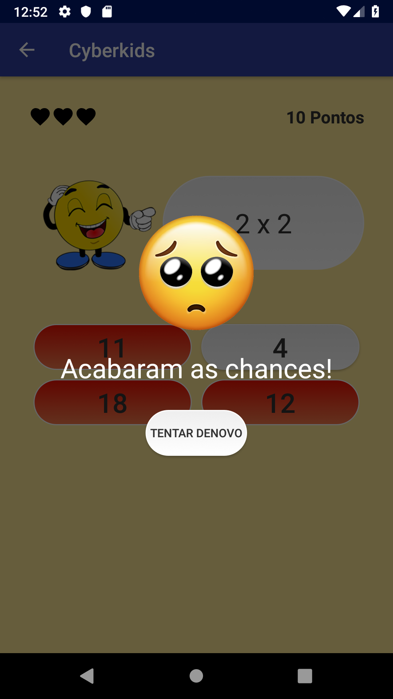

# cyberkids

Cyberkids is a simple game for children to learn the multiplication table. The app was developed together with pedagogy students who needed to present a project that could relate technology with teaching for kids.

Selection Page|Multiplication Table Page|Game Over
:-------------------------:|:-------------------------:|:-------------------------:
||

The app is available for download at Google Play (Only in Brazil).

